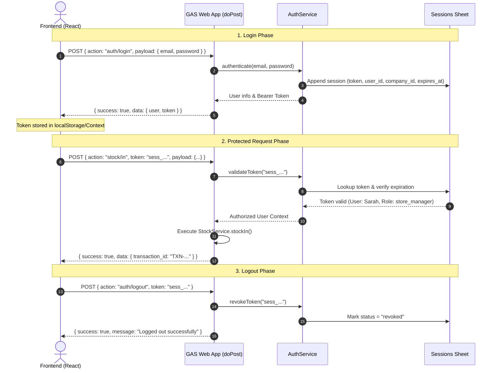

# StoreIQ — RESTful API Specification & Reference

[](#)
[](#)
[](#)

This document provides the complete API reference for the **StoreIQ** backend. It covers the JSON-RPC request/response protocol, authentication lifecycle, role permissions, and full schemas for all 41 actions across 12 domain modules.

---

## 📑 Table of Contents

1. [API Architecture & Protocol Overview](#-api-architecture--protocol-overview)
2. [Authentication Flow & Session Lifecycle](#-authentication-flow--session-lifecycle)
3. [Global Error Codes Reference](#-global-error-codes-reference)
4. [Endpoint Specifications by Module](#-endpoint-specifications-by-module)
   - [Authentication Module](#1-authentication-module) (`auth/*`)
   - [Dashboard Module](#2-dashboard-module) (`dashboard/*`)
   - [Products Module](#3-products-module) (`products/*`)
   - [Categories Module](#4-categories-module) (`categories/*`)
   - [Stock Operations Module](#5-stock-operations-module) (`stock/*`)
   - [Stock Transfers Module](#6-stock-transfers-module) (`transfers/*`)
   - [Stores & Branches Module](#7-stores--branches-module) (`stores/*`)
   - [Users & Staff Module](#8-users--staff-module) (`users/*`)
   - [Suppliers Module](#9-suppliers-module) (`suppliers/*`)
   - [Reports & Analytics Module](#10-reports--analytics-module) (`reports/*`)
   - [Audit Logs Module](#11-audit-logs-module) (`audit/*`)
   - [Settings Module](#12-settings-module) (`settings/*`)

---

## 📡 API Architecture & Protocol Overview

Because Google Apps Script Web Apps handle incoming HTTP traffic via a single entry point `doPost(e)`, StoreIQ implements an **action-based JSON-RPC pattern**.

### Endpoint Base URL
```
POST https://script.google.com/macros/s/{DEPLOYMENT_ID}/exec
```

### Standard Request Envelope
All API requests must be sent as `POST` requests with a stringified JSON body matching this envelope:

```json
{
  "action": "<module>/<action_name>",
  "token": "sess_89f1a7b8e4c3d2e1f0...",
  "payload": {
    "key": "value"
  }
}
```

| Property | Type | Required | Description |
|---|---|:---:|---|
| `action` | `String` | **Yes** | The resource and method identifier in `<module>/<action>` format. |
| `token` | `String` | Conditional | Session token returned by `auth/login`. Required for all protected actions. |
| `payload` | `Object` | Conditional | Action-specific parameters, filters, or entity data. |

---

### Standard Success Response Envelope
```json
{
  "success": true,
  "data": { ... },
  "message": "Operation completed successfully",
  "timestamp": "2026-03-22T14:30:00.000Z"
}
```

### Standard Error Response Envelope
```json
{
  "success": false,
  "error": {
    "code": "INVALID_CREDENTIALS",
    "message": "Invalid email or password",
    "details": null
  },
  "timestamp": "2026-03-22T14:30:00.000Z"
}
```

---

## 🔐 Authentication Flow & Session Lifecycle



---

## ⚠️ Global Error Codes Reference

| Error Code | HTTP Equiv | Description / Cause |
|---|:---:|---|
| `UNAUTHORIZED` | `401` | Missing, malformed, or missing authentication token. |
| `TOKEN_EXPIRED` | `401` | Session token TTL (24h) has expired; re-login required. |
| `INVALID_CREDENTIALS` | `401` | Supplied email and password combination is incorrect. |
| `FORBIDDEN` | `403` | User's role lacks sufficient privileges for the requested action. |
| `COMPANY_SUSPENDED` | `403` | Tenant company account is inactive or payment suspended. |
| `NOT_FOUND` | `404` | Requested entity ID does not exist or does not belong to user's company. |
| `VALIDATION_ERROR` | `422` | Request payload failed schema, missing required fields or negative numbers. |
| `DUPLICATE_ENTRY` | `409` | Unique constraint violation (e.g. duplicate SKU, email, or store code). |
| `INSUFFICIENT_STOCK` | `422` | Stock-out or transfer quantity exceeds available store balance. |
| `TRANSFER_INVALID_STATE`| `422` | Transfer cannot transition from current state (e.g. approving already completed). |
| `CONCURRENCY_TIMEOUT` | `408` | Database lock could not be acquired within 10s timeout. |
| `SERVER_ERROR` | `500` | Unhandled runtime exception in Google Apps Script backend. |

---

## 📚 Endpoint Specifications by Module

---

### 1. Authentication Module

#### `auth/login`
- **Method**: `POST`
- **Auth Required**: No
- **Required Role(s)**: Public
- **Description**: Authenticates user credentials, generates an active session token, and returns user profile & company details.

##### Request Payload:
```json
{
  "action": "auth/login",
  "payload": {
    "email": "sarah.c@apexretail.com",
    "password": "Password123!"
  }
}
```

##### Success Response:
```json
{
  "success": true,
  "data": {
    "token": "sess_89f1a7b8e4c3d2e1f0a9b8c7d6e5f4a3b2c1d0e9f8a7b6c5d4e3f2a1b0c9d8",
    "user": {
      "user_id": "USR-1710002002-B21",
      "company_id": "CMP-1710001001-A89",
      "store_id": "STR-1710003003-C45",
      "full_name": "Sarah Connor",
      "email": "sarah.c@apexretail.com",
      "role": "store_manager",
      "phone": "+1-555-0144",
      "avatar_url": "https://ui-avatars.com/api/?name=Sarah+Connor",
      "company": {
        "company_name": "Apex Retail Group Ltd.",
        "currency": "USD",
        "timezone": "America/Chicago"
      }
    },
    "expires_at": "2026-03-23T14:30:00.000Z"
  },
  "message": "Login successful"
}
```

##### Error Codes:
- `INVALID_CREDENTIALS`, `USER_INACTIVE`, `COMPANY_SUSPENDED`, `VALIDATION_ERROR`

---

#### `auth/logout`
- **Method**: `POST`
- **Auth Required**: Yes
- **Required Role(s)**: Any authenticated user
- **Description**: Revokes the current session token in the database.

##### Request Payload:
```json
{
  "action": "auth/logout",
  "token": "sess_89f1a7b8e4c3d2e1f0a9b8c7d6e5f4a3b2c1d0e9f8a7b6c5d4e3f2a1b0c9d8"
}
```

##### Success Response:
```json
{
  "success": true,
  "data": {
    "revoked": true
  },
  "message": "Successfully logged out"
}
```

##### Error Codes:
- `UNAUTHORIZED`, `TOKEN_EXPIRED`

---

#### `auth/me`
- **Method**: `POST`
- **Auth Required**: Yes
- **Required Role(s)**: Any authenticated user
- **Description**: Returns the current authenticated user's profile and active company settings.

##### Request Payload:
```json
{
  "action": "auth/me",
  "token": "sess_89f1a7b8e4c3d2e1f0a9b8c7d6e5f4a3b2c1d0e9f8a7b6c5d4e3f2a1b0c9d8"
}
```

##### Success Response:
```json
{
  "success": true,
  "data": {
    "user_id": "USR-1710002002-B21",
    "company_id": "CMP-1710001001-A89",
    "store_id": "STR-1710003003-C45",
    "full_name": "Sarah Connor",
    "email": "sarah.c@apexretail.com",
    "role": "store_manager",
    "status": "active",
    "company": {
      "company_id": "CMP-1710001001-A89",
      "company_name": "Apex Retail Group Ltd.",
      "currency": "USD",
      "plan_type": "professional"
    }
  },
  "message": "Profile loaded"
}
```

##### Error Codes:
- `UNAUTHORIZED`, `TOKEN_EXPIRED`

---

### 2. Dashboard Module

#### `dashboard/stats`
- **Method**: `POST`
- **Auth Required**: Yes
- **Required Role(s)**: `super_admin`, `company_admin`, `store_manager`, `viewer`
- **Description**: Retrieves high-level KPI metrics including total stock valuation, total products, low stock count, and pending transfers.

##### Request Payload:
```json
{
  "action": "dashboard/stats",
  "token": "sess_89f1a7b8e...",
  "payload": {
    "store_id": "STR-1710003003-C45" // Optional: Omit for all company stores
  }
}
```

##### Success Response:
```json
{
  "success": true,
  "data": {
    "total_products": 248,
    "total_inventory_valuation": 142500.75,
    "total_stock_units": 4820,
    "low_stock_count": 7,
    "out_of_stock_count": 2,
    "pending_transfers_count": 4,
    "recent_purchases_sum_30d": 38400.00
  }
}
```

##### Error Codes:
- `UNAUTHORIZED`, `FORBIDDEN`

---

#### `dashboard/recent-activity`
- **Method**: `POST`
- **Auth Required**: Yes
- **Required Role(s)**: `super_admin`, `company_admin`, `store_manager`, `viewer`
- **Description**: Fetches the latest stock movements, transfers, and product edits.

##### Request Payload:
```json
{
  "action": "dashboard/recent-activity",
  "token": "sess_89f1a7b8e...",
  "payload": {
    "limit": 10
  }
}
```

##### Success Response:
```json
{
  "success": true,
  "data": [
    {
      "id": "TXN-1710006006-F77",
      "type": "STOCK_IN",
      "description": "Stock In: 50x Wireless Headphones Pro",
      "store_name": "Main Warehouse",
      "user_name": "Sarah Connor",
      "timestamp": "2026-03-22T14:10:05.000Z"
    }
  ]
}
```

---

#### `dashboard/low-stock`
- **Method**: `POST`
- **Auth Required**: Yes
- **Required Role(s)**: `super_admin`, `company_admin`, `store_manager`, `inventory_staff`, `viewer`
- **Description**: Lists products whose current stock level is less than or equal to their `reorder_level`.

##### Request Payload:
```json
{
  "action": "dashboard/low-stock",
  "token": "sess_89f1a7b8e...",
  "payload": {
    "store_id": "STR-1710003003-C45"
  }
}
```

##### Success Response:
```json
{
  "success": true,
  "data": [
    {
      "product_id": "PRD-1710005005-E99",
      "product_name": "Noise-Cancelling Wireless Headphones Pro",
      "sku": "AUD-WRL-NC-PRO-BLK",
      "current_stock": 8,
      "reorder_level": 15,
      "deficit": 7,
      "store_name": "Downtown Branch"
    }
  ]
}
```

---

### 3. Products Module

#### `products/list`
- **Method**: `POST`
- **Auth Required**: Yes
- **Required Role(s)**: Any authenticated user
- **Description**: Returns a paginated list of catalog products with computed stock levels.

##### Request Payload:
```json
{
  "action": "products/list",
  "token": "sess_89f1a7b8e...",
  "payload": {
    "search": "Headphones",
    "category_id": "CAT-1710004004-D11",
    "store_id": "STR-1710003003-C45",
    "is_active": true,
    "page": 1,
    "limit": 20
  }
}
```

##### Success Response:
```json
{
  "success": true,
  "data": {
    "items": [
      {
        "product_id": "PRD-1710005005-E99",
        "product_name": "Noise-Cancelling Wireless Headphones Pro",
        "sku": "AUD-WRL-NC-PRO-BLK",
        "barcode": "8901234567890",
        "category_id": "CAT-1710004004-D11",
        "category_name": "Consumer Electronics",
        "unit": "piece",
        "cost_price": 45.00,
        "selling_price": 89.99,
        "reorder_level": 15,
        "current_stock": 75,
        "is_active": true
      }
    ],
    "pagination": {
      "page": 1,
      "limit": 20,
      "total_items": 1,
      "total_pages": 1
    }
  }
}
```

---

#### `products/get`
- **Method**: `POST`
- **Auth Required**: Yes
- **Required Role(s)**: Any authenticated user
- **Description**: Fetches single product details along with per-store inventory breakdown.

##### Request Payload:
```json
{
  "action": "products/get",
  "token": "sess_89f1a7b8e...",
  "payload": {
    "product_id": "PRD-1710005005-E99"
  }
}
```

##### Success Response:
```json
{
  "success": true,
  "data": {
    "product_id": "PRD-1710005005-E99",
    "product_name": "Noise-Cancelling Wireless Headphones Pro",
    "sku": "AUD-WRL-NC-PRO-BLK",
    "cost_price": 45.00,
    "selling_price": 89.99,
    "reorder_level": 15,
    "total_stock": 75,
    "store_breakdown": [
      { "store_id": "STR-001", "store_name": "Main Warehouse", "stock": 50 },
      { "store_id": "STR-002", "store_name": "Downtown Branch", "stock": 25 }
    ]
  }
}
```

##### Error Codes:
- `NOT_FOUND`

---

#### `products/create`
- **Method**: `POST`
- **Auth Required**: Yes
- **Required Role(s)**: `super_admin`, `company_admin`, `store_manager`
- **Description**: Creates a new product catalog item.

##### Request Payload:
```json
{
  "action": "products/create",
  "token": "sess_89f1a7b8e...",
  "payload": {
    "product_name": "Mechanical Keyboard RGB",
    "sku": "ACC-MECH-KB-01",
    "barcode": "8909876543210",
    "category_id": "CAT-1710004004-D11",
    "supplier_id": "SUP-1710008008-H33",
    "unit": "piece",
    "cost_price": 32.00,
    "selling_price": 64.99,
    "reorder_level": 10,
    "ideal_stock": 40,
    "description": "Tenkeyless mechanical gaming keyboard"
  }
}
```

##### Success Response:
```json
{
  "success": true,
  "data": {
    "product_id": "PRD-1710005010-E10",
    "product_name": "Mechanical Keyboard RGB",
    "sku": "ACC-MECH-KB-01"
  },
  "message": "Product created successfully"
}
```

##### Error Codes:
- `DUPLICATE_ENTRY` (SKU already exists), `VALIDATION_ERROR`, `FORBIDDEN`

---

#### `products/update`
- **Method**: `POST`
- **Auth Required**: Yes
- **Required Role(s)**: `super_admin`, `company_admin`, `store_manager`
- **Description**: Updates product metadata and pricing.

##### Request Payload:
```json
{
  "action": "products/update",
  "token": "sess_89f1a7b8e...",
  "payload": {
    "product_id": "PRD-1710005010-E10",
    "selling_price": 59.99,
    "reorder_level": 12
  }
}
```

##### Success Response:
```json
{
  "success": true,
  "data": {
    "product_id": "PRD-1710005010-E10",
    "updated": true
  },
  "message": "Product updated successfully"
}
```

---

#### `products/deactivate`
- **Method**: `POST`
- **Auth Required**: Yes
- **Required Role(s)**: `super_admin`, `company_admin`
- **Description**: Soft deletes a product (`is_active = false`).

##### Request Payload:
```json
{
  "action": "products/deactivate",
  "token": "sess_89f1a7b8e...",
  "payload": {
    "product_id": "PRD-1710005010-E10"
  }
}
```

##### Success Response:
```json
{
  "success": true,
  "message": "Product deactivated successfully"
}
```

---

### 4. Categories Module

#### `categories/list`
- **Method**: `POST`
- **Auth Required**: Yes
- **Required Role(s)**: Any authenticated user
- **Description**: Lists all active categories for the company.

##### Request Payload:
```json
{
  "action": "categories/list",
  "token": "sess_89f1a7b8e...",
  "payload": {}
}
```

##### Success Response:
```json
{
  "success": true,
  "data": [
    {
      "category_id": "CAT-1710004004-D11",
      "category_name": "Consumer Electronics",
      "slug": "consumer-electronics",
      "product_count": 42
    }
  ]
}
```

---

#### `categories/create`
- **Method**: `POST`
- **Auth Required**: Yes
- **Required Role(s)**: `super_admin`, `company_admin`, `store_manager`
- **Description**: Creates a new product category.

##### Request Payload:
```json
{
  "action": "categories/create",
  "token": "sess_89f1a7b8e...",
  "payload": {
    "category_name": "Home Appliances",
    "description": "Kitchen and living room electric appliances"
  }
}
```

##### Success Response:
```json
{
  "success": true,
  "data": {
    "category_id": "CAT-1710004015-D22",
    "category_name": "Home Appliances",
    "slug": "home-appliances"
  },
  "message": "Category created successfully"
}
```

---

#### `categories/update`
- **Method**: `POST`
- **Auth Required**: Yes
- **Required Role(s)**: `super_admin`, `company_admin`, `store_manager`
- **Description**: Renames or updates an existing category.

##### Request Payload:
```json
{
  "action": "categories/update",
  "token": "sess_89f1a7b8e...",
  "payload": {
    "category_id": "CAT-1710004015-D22",
    "category_name": "Smart Home Appliances"
  }
}
```

##### Success Response:
```json
{
  "success": true,
  "message": "Category updated successfully"
}
```

---

### 5. Stock Operations Module

#### `stock/in`
- **Method**: `POST`
- **Auth Required**: Yes
- **Required Role(s)**: `super_admin`, `company_admin`, `store_manager`, `inventory_staff`
- **Description**: Records a Stock In transaction (purchase receipt, restock, or supplier delivery).

##### Request Payload:
```json
{
  "action": "stock/in",
  "token": "sess_89f1a7b8e...",
  "payload": {
    "store_id": "STR-1710003003-C45",
    "product_id": "PRD-1710005005-E99",
    "quantity": 50,
    "unit_cost": 45.00,
    "reference_type": "PURCHASE_ORDER",
    "reference_id": "PO-2026-0045",
    "notes": "Delivered by SoundWave"
  }
}
```

##### Success Response:
```json
{
  "success": true,
  "data": {
    "transaction_id": "TXN-1710006020-F90",
    "product_id": "PRD-1710005005-E99",
    "store_id": "STR-1710003003-C45",
    "new_stock_balance": 125,
    "created_at": "2026-03-22T15:00:00.000Z"
  },
  "message": "Stock added successfully"
}
```

##### Error Codes:
- `VALIDATION_ERROR`, `NOT_FOUND`

---

#### `stock/out`
- **Method**: `POST`
- **Auth Required**: Yes
- **Required Role(s)**: `super_admin`, `company_admin`, `store_manager`, `inventory_staff`
- **Description**: Records a Stock Out transaction (sale dispatch, damage write-off, or return to vendor).

##### Request Payload:
```json
{
  "action": "stock/out",
  "token": "sess_89f1a7b8e...",
  "payload": {
    "store_id": "STR-1710003003-C45",
    "product_id": "PRD-1710005005-E99",
    "quantity": 5,
    "reference_type": "SALES_INVOICE",
    "reference_id": "INV-2026-8801",
    "notes": "Direct counter sale"
  }
}
```

##### Success Response:
```json
{
  "success": true,
  "data": {
    "transaction_id": "TXN-1710006021-F91",
    "new_stock_balance": 120
  },
  "message": "Stock deducted successfully"
}
```

##### Error Codes:
- `INSUFFICIENT_STOCK`, `VALIDATION_ERROR`, `NOT_FOUND`

---

#### `stock/current`
- **Method**: `POST`
- **Auth Required**: Yes
- **Required Role(s)**: Any authenticated user
- **Description**: Queries real-time computed stock level for a product at a specific store or company-wide.

##### Request Payload:
```json
{
  "action": "stock/current",
  "token": "sess_89f1a7b8e...",
  "payload": {
    "product_id": "PRD-1710005005-E99",
    "store_id": "STR-1710003003-C45"
  }
}
```

##### Success Response:
```json
{
  "success": true,
  "data": {
    "product_id": "PRD-1710005005-E99",
    "store_id": "STR-1710003003-C45",
    "stock_on_hand": 120,
    "reorder_level": 15,
    "is_low_stock": false
  }
}
```

---

#### `stock/history`
- **Method**: `POST`
- **Auth Required**: Yes
- **Required Role(s)**: Any authenticated user
- **Description**: Returns chronological transaction audit logs for a product and store.

##### Request Payload:
```json
{
  "action": "stock/history",
  "token": "sess_89f1a7b8e...",
  "payload": {
    "product_id": "PRD-1710005005-E99",
    "store_id": "STR-1710003003-C45",
    "limit": 50
  }
}
```

##### Success Response:
```json
{
  "success": true,
  "data": [
    {
      "transaction_id": "TXN-1710006021-F91",
      "transaction_type": "STOCK_OUT",
      "quantity": 5,
      "unit_cost": 45.00,
      "reference_type": "SALES_INVOICE",
      "reference_id": "INV-2026-8801",
      "user_name": "Sarah Connor",
      "created_at": "2026-03-22T15:05:00.000Z"
    }
  ]
}
```

---

#### `stock/low`
- **Method**: `POST`
- **Auth Required**: Yes
- **Required Role(s)**: Any authenticated user
- **Description**: Returns all catalog items whose stock is at or below `reorder_level`.

##### Request Payload:
```json
{
  "action": "stock/low",
  "token": "sess_89f1a7b8e...",
  "payload": {
    "store_id": "STR-1710003003-C45"
  }
}
```

##### Success Response:
```json
{
  "success": true,
  "data": [
    {
      "product_id": "PRD-1710005008-E02",
      "product_name": "USB-C Fast Charging Cable 2m",
      "sku": "CBL-USBC-2M",
      "current_stock": 4,
      "reorder_level": 20
    }
  ]
}
```

---

### 6. Stock Transfers Module

#### `transfers/create`
- **Method**: `POST`
- **Auth Required**: Yes
- **Required Role(s)**: `super_admin`, `company_admin`, `store_manager`, `inventory_staff`
- **Description**: Initiates a stock transfer request between two stores in `pending` status.

##### Request Payload:
```json
{
  "action": "transfers/create",
  "token": "sess_89f1a7b8e...",
  "payload": {
    "source_store_id": "STR-1710003003-C45",
    "dest_store_id": "STR-1710003004-C46",
    "product_id": "PRD-1710005005-E99",
    "quantity": 15,
    "shipping_notes": "Urgent branch replenishment"
  }
}
```

##### Success Response:
```json
{
  "success": true,
  "data": {
    "transfer_id": "TRF-1710007025-G55",
    "transfer_number": "TRF-2026-0004",
    "status": "pending",
    "quantity": 15
  },
  "message": "Transfer request created"
}
```

##### Error Codes:
- `INSUFFICIENT_STOCK`, `VALIDATION_ERROR` (e.g. source == destination)

---

#### `transfers/approve`
- **Method**: `POST`
- **Auth Required**: Yes
- **Required Role(s)**: `super_admin`, `company_admin`, `store_manager`
- **Description**: Approves a pending transfer, changing its status to `in_transit`.

##### Request Payload:
```json
{
  "action": "transfers/approve",
  "token": "sess_89f1a7b8e...",
  "payload": {
    "transfer_id": "TRF-1710007025-G55"
  }
}
```

##### Success Response:
```json
{
  "success": true,
  "data": {
    "transfer_id": "TRF-1710007025-G55",
    "status": "in_transit",
    "approved_at": "2026-03-22T15:20:00.000Z"
  },
  "message": "Transfer approved and marked in transit"
}
```

##### Error Codes:
- `TRANSFER_INVALID_STATE`, `FORBIDDEN`

---

#### `transfers/complete`
- **Method**: `POST`
- **Auth Required**: Yes
- **Required Role(s)**: `super_admin`, `company_admin`, `store_manager`
- **Description**: Confirms arrival at destination store, updates status to `completed`, and atomically appends ledger entries.

##### Request Payload:
```json
{
  "action": "transfers/complete",
  "token": "sess_89f1a7b8e...",
  "payload": {
    "transfer_id": "TRF-1710007025-G55"
  }
}
```

##### Success Response:
```json
{
  "success": true,
  "data": {
    "transfer_id": "TRF-1710007025-G55",
    "status": "completed",
    "out_transaction_id": "TXN-1710006030-F92",
    "in_transaction_id": "TXN-1710006031-F93"
  },
  "message": "Transfer completed successfully"
}
```

---

#### `transfers/cancel`
- **Method**: `POST`
- **Auth Required**: Yes
- **Required Role(s)**: `super_admin`, `company_admin`, `store_manager`
- **Description**: Cancels a pending or in-transit transfer.

##### Request Payload:
```json
{
  "action": "transfers/cancel",
  "token": "sess_89f1a7b8e...",
  "payload": {
    "transfer_id": "TRF-1710007025-G55",
    "reason": "Replenishment no longer required"
  }
}
```

##### Success Response:
```json
{
  "success": true,
  "message": "Transfer cancelled"
}
```

---

#### `transfers/list`
- **Method**: `POST`
- **Auth Required**: Yes
- **Required Role(s)**: Any authenticated user
- **Description**: Lists stock transfers with optional status and store filters.

##### Request Payload:
```json
{
  "action": "transfers/list",
  "token": "sess_89f1a7b8e...",
  "payload": {
    "status": "pending",
    "store_id": "STR-1710003003-C45"
  }
}
```

##### Success Response:
```json
{
  "success": true,
  "data": [
    {
      "transfer_id": "TRF-1710007025-G55",
      "transfer_number": "TRF-2026-0004",
      "source_store_name": "Main Warehouse",
      "dest_store_name": "Downtown Branch",
      "product_name": "Noise-Cancelling Wireless Headphones Pro",
      "quantity": 15,
      "status": "pending",
      "initiated_by_name": "Sarah Connor",
      "initiated_at": "2026-03-22T15:15:00.000Z"
    }
  ]
}
```

---

### 7. Stores & Branches Module

#### `stores/list`
- **Method**: `POST`
- **Auth Required**: Yes
- **Required Role(s)**: Any authenticated user
- **Description**: Lists all active store branches and warehouses for the company.

##### Request Payload:
```json
{
  "action": "stores/list",
  "token": "sess_89f1a7b8e...",
  "payload": {}
}
```

##### Success Response:
```json
{
  "success": true,
  "data": [
    {
      "store_id": "STR-1710003003-C45",
      "store_name": "Main Distribution Center",
      "store_code": "WH-MAIN",
      "type": "warehouse",
      "city": "Austin",
      "country": "US",
      "is_active": true
    }
  ]
}
```

---

#### `stores/create`
- **Method**: `POST`
- **Auth Required**: Yes
- **Required Role(s)**: `super_admin`, `company_admin`
- **Description**: Registers a new store branch or warehouse.

##### Request Payload:
```json
{
  "action": "stores/create",
  "token": "sess_89f1a7b8e...",
  "payload": {
    "store_name": "Uptown Mall Store",
    "store_code": "RET-UPTOWN",
    "type": "retail_store",
    "address": "1200 North Loop Blvd",
    "city": "Austin",
    "country": "US"
  }
}
```

##### Success Response:
```json
{
  "success": true,
  "data": {
    "store_id": "STR-1710003010-C50",
    "store_name": "Uptown Mall Store"
  },
  "message": "Store branch created successfully"
}
```

---

#### `stores/update`
- **Method**: `POST`
- **Auth Required**: Yes
- **Required Role(s)**: `super_admin`, `company_admin`
- **Description**: Updates store metadata, address, or manager assignment.

##### Request Payload:
```json
{
  "action": "stores/update",
  "token": "sess_89f1a7b8e...",
  "payload": {
    "store_id": "STR-1710003010-C50",
    "manager_id": "USR-1710002002-B21"
  }
}
```

##### Success Response:
```json
{
  "success": true,
  "message": "Store updated successfully"
}
```

---

### 8. Users & Staff Module

#### `users/list`
- **Method**: `POST`
- **Auth Required**: Yes
- **Required Role(s)**: `super_admin`, `company_admin`
- **Description**: Lists all staff members in the company.

##### Request Payload:
```json
{
  "action": "users/list",
  "token": "sess_89f1a7b8e...",
  "payload": {}
}
```

##### Success Response:
```json
{
  "success": true,
  "data": [
    {
      "user_id": "USR-1710002002-B21",
      "full_name": "Sarah Connor",
      "email": "sarah.c@apexretail.com",
      "role": "store_manager",
      "store_id": "STR-1710003003-C45",
      "store_name": "Main Warehouse",
      "status": "active"
    }
  ]
}
```

---

#### `users/create`
- **Method**: `POST`
- **Auth Required**: Yes
- **Required Role(s)**: `super_admin`, `company_admin`
- **Description**: Creates a new user account with assigned role and optional store binding.

##### Request Payload:
```json
{
  "action": "users/create",
  "token": "sess_89f1a7b8e...",
  "payload": {
    "full_name": "John Reese",
    "email": "john.r@apexretail.com",
    "password": "SecurePassword2026!",
    "role": "inventory_staff",
    "store_id": "STR-1710003003-C45"
  }
}
```

##### Success Response:
```json
{
  "success": true,
  "data": {
    "user_id": "USR-1710002015-B33",
    "full_name": "John Reese",
    "email": "john.r@apexretail.com"
  },
  "message": "User created successfully"
}
```

##### Error Codes:
- `DUPLICATE_ENTRY` (Email already in use), `FORBIDDEN`, `VALIDATION_ERROR`

---

#### `users/update`
- **Method**: `POST`
- **Auth Required**: Yes
- **Required Role(s)**: `super_admin`, `company_admin`
- **Description**: Modifies user role, store assignment, or profile info.

##### Request Payload:
```json
{
  "action": "users/update",
  "token": "sess_89f1a7b8e...",
  "payload": {
    "user_id": "USR-1710002015-B33",
    "role": "store_manager"
  }
}
```

##### Success Response:
```json
{
  "success": true,
  "message": "User updated successfully"
}
```

---

#### `users/deactivate`
- **Method**: `POST`
- **Auth Required**: Yes
- **Required Role(s)**: `super_admin`, `company_admin`
- **Description**: Deactivates a staff account and invalidates all active sessions.

##### Request Payload:
```json
{
  "action": "users/deactivate",
  "token": "sess_89f1a7b8e...",
  "payload": {
    "user_id": "USR-1710002015-B33"
  }
}
```

##### Success Response:
```json
{
  "success": true,
  "message": "User deactivated successfully"
}
```

---

### 9. Suppliers Module

#### `suppliers/list`
- **Method**: `POST`
- **Auth Required**: Yes
- **Required Role(s)**: Any authenticated user
- **Description**: Lists registered vendors and supplier contacts.

##### Request Payload:
```json
{
  "action": "suppliers/list",
  "token": "sess_89f1a7b8e...",
  "payload": {}
}
```

##### Success Response:
```json
{
  "success": true,
  "data": [
    {
      "supplier_id": "SUP-1710008008-H33",
      "supplier_name": "SoundWave Electronics Direct",
      "contact_person": "David Vance",
      "email": "orders@soundwavedirect.com",
      "payment_terms": "net_30",
      "lead_time_days": 5
    }
  ]
}
```

---

#### `suppliers/create`
- **Method**: `POST`
- **Auth Required**: Yes
- **Required Role(s)**: `super_admin`, `company_admin`
- **Description**: Registers a new vendor.

##### Request Payload:
```json
{
  "action": "suppliers/create",
  "token": "sess_89f1a7b8e...",
  "payload": {
    "supplier_name": "Nordic Cable Supply",
    "contact_person": "Elena Rostova",
    "email": "elena@nordiccables.com",
    "phone": "+1-800-555-9011",
    "payment_terms": "net_15",
    "lead_time_days": 3
  }
}
```

##### Success Response:
```json
{
  "success": true,
  "data": {
    "supplier_id": "SUP-1710008012-H40",
    "supplier_name": "Nordic Cable Supply"
  },
  "message": "Supplier added successfully"
}
```

---

#### `suppliers/update`
- **Method**: `POST`
- **Auth Required**: Yes
- **Required Role(s)**: `super_admin`, `company_admin`
- **Description**: Modifies vendor contact details or payment terms.

##### Request Payload:
```json
{
  "action": "suppliers/update",
  "token": "sess_89f1a7b8e...",
  "payload": {
    "supplier_id": "SUP-1710008012-H40",
    "lead_time_days": 4
  }
}
```

##### Success Response:
```json
{
  "success": true,
  "message": "Supplier updated successfully"
}
```

---

### 10. Reports & Analytics Module

#### `reports/stock`
- **Method**: `POST`
- **Auth Required**: Yes
- **Required Role(s)**: `super_admin`, `company_admin`, `store_manager`, `viewer`
- **Description**: Generates a complete inventory valuation and stock on hand audit per store.

##### Request Payload:
```json
{
  "action": "reports/stock",
  "token": "sess_89f1a7b8e...",
  "payload": {
    "store_id": "STR-1710003003-C45"
  }
}
```

##### Success Response:
```json
{
  "success": true,
  "data": {
    "generated_at": "2026-03-22T15:30:00.000Z",
    "total_stock_value": 85400.00,
    "total_retail_value": 142200.00,
    "items": [
      {
        "product_id": "PRD-1710005005-E99",
        "sku": "AUD-WRL-NC-PRO-BLK",
        "product_name": "Noise-Cancelling Wireless Headphones Pro",
        "stock_on_hand": 120,
        "cost_price": 45.00,
        "selling_price": 89.99,
        "total_cost_valuation": 5400.00,
        "total_retail_valuation": 10798.80
      }
    ]
  }
}
```

---

#### `reports/activity`
- **Method**: `POST`
- **Auth Required**: Yes
- **Required Role(s)**: `super_admin`, `company_admin`, `store_manager`, `viewer`
- **Description**: Summarizes inventory inflows and outflows over a specific date range.

##### Request Payload:
```json
{
  "action": "reports/activity",
  "token": "sess_89f1a7b8e...",
  "payload": {
    "start_date": "2026-03-01T00:00:00.000Z",
    "end_date": "2026-03-22T23:59:59.000Z"
  }
}
```

##### Success Response:
```json
{
  "success": true,
  "data": {
    "total_inward_units": 450,
    "total_inward_cost": 20250.00,
    "total_outward_units": 380,
    "total_outward_revenue": 34200.00,
    "total_transfers_completed": 12
  }
}
```

---

#### `reports/low-stock`
- **Method**: `POST`
- **Auth Required**: Yes
- **Required Role(s)**: `super_admin`, `company_admin`, `store_manager`, `viewer`
- **Description**: Generates an export-ready low stock and suggested reorder replenishment list.

##### Request Payload:
```json
{
  "action": "reports/low-stock",
  "token": "sess_89f1a7b8e...",
  "payload": {}
}
```

##### Success Response:
```json
{
  "success": true,
  "data": [
    {
      "product_id": "PRD-1710005008-E02",
      "product_name": "USB-C Fast Charging Cable 2m",
      "sku": "CBL-USBC-2M",
      "supplier_name": "Nordic Cable Supply",
      "current_stock": 4,
      "reorder_level": 20,
      "suggested_order_qty": 50,
      "estimated_cost": 150.00
    }
  ]
}
```

---

#### `reports/dashboard`
- **Method**: `POST`
- **Auth Required**: Yes
- **Required Role(s)**: `super_admin`, `company_admin`, `store_manager`, `viewer`
- **Description**: Returns 30-day time series data for inventory turnover and sales volume charts.

##### Request Payload:
```json
{
  "action": "reports/dashboard",
  "token": "sess_89f1a7b8e...",
  "payload": {
    "period_days": 30
  }
}
```

##### Success Response:
```json
{
  "success": true,
  "data": {
    "chart_data": [
      { "date": "2026-03-20", "stock_in": 120, "stock_out": 45 },
      { "date": "2026-03-21", "stock_in": 0, "stock_out": 62 },
      { "date": "2026-03-22", "stock_in": 50, "stock_out": 38 }
    ]
  }
}
```

---

### 11. Audit Logs Module

#### `audit/list`
- **Method**: `POST`
- **Auth Required**: Yes
- **Required Role(s)**: `super_admin`, `company_admin`
- **Description**: Queries immutable system audit trail with user and entity filtering.

##### Request Payload:
```json
{
  "action": "audit/list",
  "token": "sess_89f1a7b8e...",
  "payload": {
    "entity": "Stock_Transactions",
    "limit": 25
  }
}
```

##### Success Response:
```json
{
  "success": true,
  "data": [
    {
      "log_id": "LOG-1710010010-K88",
      "user_name": "Sarah Connor",
      "action": "STOCK_OUT",
      "entity": "Stock_Transactions",
      "entity_id": "TXN-1710006021-F91",
      "changes_json": "{\"quantity\": 5, \"product_id\": \"PRD-1710005005-E99\"}",
      "ip_address": "198.51.100.42",
      "created_at": "2026-03-22T15:05:00.000Z"
    }
  ]
}
```

##### Error Codes:
- `FORBIDDEN` (Requires admin role)

---

### 12. Settings Module

#### `settings/get`
- **Method**: `POST`
- **Auth Required**: Yes
- **Required Role(s)**: `super_admin`, `company_admin`
- **Description**: Returns all company configuration parameters.

##### Request Payload:
```json
{
  "action": "settings/get",
  "token": "sess_89f1a7b8e...",
  "payload": {}
}
```

##### Success Response:
```json
{
  "success": true,
  "data": {
    "company_name": "Apex Retail Group Ltd.",
    "currency": "USD",
    "currency_symbol": "$",
    "low_stock_notification_email": "inventory.alerts@apexretail.com",
    "enable_negative_stock": false,
    "default_tax_rate": 7.5
  }
}
```

---

#### `settings/update`
- **Method**: `POST`
- **Auth Required**: Yes
- **Required Role(s)**: `super_admin`, `company_admin`
- **Description**: Updates company settings.

##### Request Payload:
```json
{
  "action": "settings/update",
  "token": "sess_89f1a7b8e...",
  "payload": {
    "settings": {
      "low_stock_notification_email": "ops@apexretail.com",
      "default_tax_rate": 8.0
    }
  }
}
```

##### Success Response:
```json
{
  "success": true,
  "data": {
    "updated_keys": ["low_stock_notification_email", "default_tax_rate"]
  },
  "message": "Settings updated successfully"
}
```

##### Error Codes:
- `FORBIDDEN`, `VALIDATION_ERROR`
