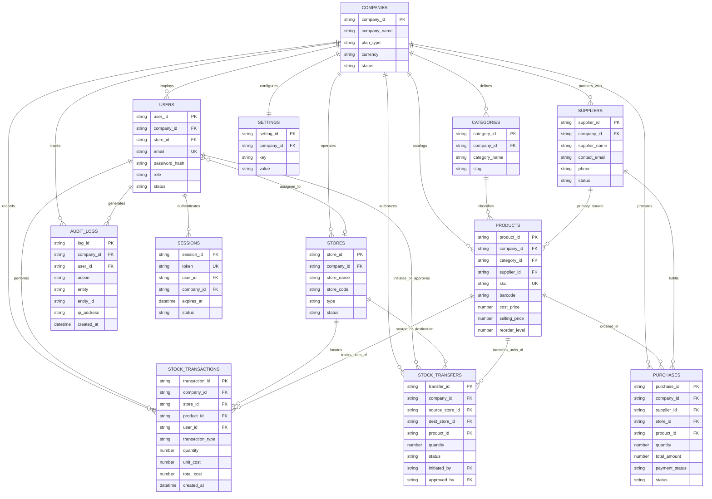

# StoreIQ — Database Schema & Architecture Specification

[](https://www.google.com/sheets/about/)
[](#)
[](#)

This document provides the authoritative reference for the **StoreIQ** database schema, relational constraints, entity-relationship topology, double-entry inventory ledger mathematics, and data integrity guarantees.

---

## 📑 Table of Contents

1. [Entity Relationship (ER) Diagram](#-entity-relationship-er-diagram)
2. [Database Schema Specification (12 Tables)](#-database-schema-specification)
   - [1. Companies](#1-companies)
   - [2. Users](#2-users)
   - [3. Stores](#3-stores)
   - [4. Categories](#4-categories)
   - [5. Products](#5-products)
   - [6. Stock_Transactions](#6-stock_transactions)
   - [7. Stock_Transfers](#7-stock_transfers)
   - [8. Suppliers](#8-suppliers)
   - [9. Purchases](#9-purchases)
   - [10. Audit_Logs](#10-audit_logs)
   - [11. Settings](#11-settings)
   - [12. Sessions](#12-sessions)
3. [Inventory Ledger Calculation Formula](#-inventory-ledger-calculation-formula)
4. [Data Integrity & Concurrency Rules](#-data-integrity--concurrency-rules)
5. [Indexing & Query Optimization in Google Sheets](#-indexing--query-optimization-in-google-sheets)

---

## 📊 Entity Relationship (ER) Diagram



---

## 🗄 Database Schema Specification

### 1. Companies
Stores master tenant accounts and subscription status.

| Column Name | Data Type | Required | Constraints / Default | Description & Allowed Values |
|---|---|:---:|---|---|
| `company_id` | `String` | **Yes** | `PRIMARY KEY`, Pattern: `CMP-{timestamp}-{rand}` | Unique global tenant identifier |
| `company_name` | `String` | **Yes** | Min 2, Max 100 chars | Legal or operating business name |
| `owner_name` | `String` | **Yes** | Max 100 chars | Primary account owner / representative |
| `email` | `String` | **Yes** | `UNIQUE`, Valid Email | Primary corporate billing/contact email |
| `phone` | `String` | No | Max 30 chars | Phone number with country code |
| `address` | `String` | No | Max 255 chars | Registered corporate address |
| `currency` | `String` | **Yes** | Default: `"USD"` | 3-letter ISO 4217 code (e.g. `USD`, `EUR`, `GBP`, `AED`, `BDT`) |
| `timezone` | `String` | **Yes** | Default: `"UTC"` | IANA timezone string (e.g. `America/New_York`, `Asia/Dhaka`) |
| `plan_type` | `String` | **Yes** | Default: `"starter"` | Allowed: `free_tier`, `starter`, `professional`, `enterprise` |
| `max_stores` | `Number` | **Yes** | Default: `3` | Allowed store branch quota |
| `max_users` | `Number` | **Yes** | Default: `5` | Allowed staff account quota |
| `status` | `String` | **Yes** | Default: `"active"` | Allowed: `active`, `suspended`, `cancelled`, `trial` |
| `created_at` | `DateTime`| **Yes** | ISO-8601 UTC | Record creation timestamp |
| `updated_at` | `DateTime`| **Yes** | ISO-8601 UTC | Last record update timestamp |

#### Example JSON:
```json
{
  "company_id": "CMP-1710001001-A89",
  "company_name": "Apex Retail Group Ltd.",
  "owner_name": "Zakariya Miller",
  "email": "owner@apexretail.com",
  "phone": "+1-555-0199",
  "address": "742 Evergreen Terrace, Suite 100, Austin, TX",
  "currency": "USD",
  "timezone": "America/Chicago",
  "plan_type": "professional",
  "max_stores": 10,
  "max_users": 25,
  "status": "active",
  "created_at": "2026-01-15T08:30:00.000Z",
  "updated_at": "2026-03-01T12:00:00.000Z"
}
```

---

### 2. Users
User accounts with multi-tenant isolation, role definitions, and salted password hashes.

| Column Name | Data Type | Required | Constraints / Default | Description & Allowed Values |
|---|---|:---:|---|---|
| `user_id` | `String` | **Yes** | `PRIMARY KEY`, Pattern: `USR-{timestamp}-{rand}` | Unique user account identifier |
| `company_id` | `String` | **Yes** | `FOREIGN KEY` -> `Companies(company_id)` | Tenant partition key |
| `store_id` | `String` | No | `FOREIGN KEY` -> `Stores(store_id)` | Null for `company_admin`/`super_admin`; set for store staff |
| `full_name` | `String` | **Yes** | Max 100 chars | Full display name of the staff member |
| `email` | `String` | **Yes** | `UNIQUE` per company, Valid Email | Staff login email address |
| `password_hash` | `String` | **Yes** | SHA-256 with tenant salt | Cryptographic password hash (never plaintext) |
| `role` | `String` | **Yes** | Enum | Allowed: `super_admin`, `company_admin`, `store_manager`, `inventory_staff`, `viewer` |
| `phone` | `String` | No | Max 30 chars | Staff contact number |
| `avatar_url` | `String` | No | Valid URL | Optional profile image link |
| `status` | `String` | **Yes** | Default: `"active"` | Allowed: `active`, `inactive`, `locked` |
| `last_login_at` | `DateTime`| No | ISO-8601 UTC | Timestamp of the most recent successful login |
| `created_at` | `DateTime`| **Yes** | ISO-8601 UTC | Creation timestamp |
| `updated_at` | `DateTime`| **Yes** | ISO-8601 UTC | Modification timestamp |

#### Example JSON:
```json
{
  "user_id": "USR-1710002002-B21",
  "company_id": "CMP-1710001001-A89",
  "store_id": "STR-1710003003-C45",
  "full_name": "Sarah Connor",
  "email": "sarah.c@apexretail.com",
  "password_hash": "e3b0c44298fc1c149afbf4c8996fb92427ae41e4649b934ca495991b7852b855",
  "role": "store_manager",
  "phone": "+1-555-0144",
  "avatar_url": "https://ui-avatars.com/api/?name=Sarah+Connor",
  "status": "active",
  "last_login_at": "2026-03-22T09:14:22.000Z",
  "created_at": "2026-01-16T10:00:00.000Z",
  "updated_at": "2026-03-22T09:14:22.000Z"
}
```

---

### 3. Stores
Physical store branches, distribution centers, and warehouses.

| Column Name | Data Type | Required | Constraints / Default | Description & Allowed Values |
|---|---|:---:|---|---|
| `store_id` | `String` | **Yes** | `PRIMARY KEY`, Pattern: `STR-{timestamp}-{rand}` | Unique store branch identifier |
| `company_id` | `String` | **Yes** | `FOREIGN KEY` -> `Companies(company_id)` | Tenant partition key |
| `store_name` | `String` | **Yes** | Max 100 chars | Operational name (e.g., "Downtown Flagship") |
| `store_code` | `String` | **Yes** | `UNIQUE` per company (e.g. `DT-01`) | Short alphanumeric identifier for reporting & barcodes |
| `type` | `String` | **Yes** | Default: `"retail_store"` | Allowed: `retail_store`, `warehouse`, `outlet`, `virtual_fulfillment` |
| `manager_id` | `String` | No | `FOREIGN KEY` -> `Users(user_id)` | Assigned store manager |
| `phone` | `String` | No | Max 30 chars | Store direct phone number |
| `email` | `String` | No | Valid Email | Store branch contact email |
| `address` | `String` | **Yes** | Max 255 chars | Physical street address |
| `city` | `String` | **Yes** | Max 100 chars | City |
| `state_province` | `String` | No | Max 100 chars | State / Province / Region |
| `country` | `String` | **Yes** | ISO-3166 2-letter (e.g. `US`, `GB`) | Country code |
| `is_active` | `Boolean` | **Yes** | Default: `true` | Active status flag |
| `created_at` | `DateTime`| **Yes** | ISO-8601 UTC | Creation timestamp |
| `updated_at` | `DateTime`| **Yes** | ISO-8601 UTC | Modification timestamp |

#### Example JSON:
```json
{
  "store_id": "STR-1710003003-C45",
  "company_id": "CMP-1710001001-A89",
  "store_name": "Main Distribution Center",
  "store_code": "WH-MAIN",
  "type": "warehouse",
  "manager_id": "USR-1710002002-B21",
  "phone": "+1-555-0800",
  "email": "warehouse.main@apexretail.com",
  "address": "400 Logistics Blvd, Industrial Zone",
  "city": "Austin",
  "state_province": "Texas",
  "country": "US",
  "is_active": true,
  "created_at": "2026-01-15T09:00:00.000Z",
  "updated_at": "2026-02-10T14:30:00.000Z"
}
```

---

### 4. Categories
Taxonomy hierarchy for product classification.

| Column Name | Data Type | Required | Constraints / Default | Description & Allowed Values |
|---|---|:---:|---|---|
| `category_id` | `String` | **Yes** | `PRIMARY KEY`, Pattern: `CAT-{timestamp}-{rand}` | Unique category identifier |
| `company_id` | `String` | **Yes** | `FOREIGN KEY` -> `Companies(company_id)` | Tenant partition key |
| `category_name`| `String` | **Yes** | Max 100 chars | Category display name |
| `slug` | `String` | **Yes** | URL-safe string | Hyphenated alphanumeric slug (e.g. `electronics-audio`) |
| `description` | `String` | No | Max 500 chars | Short descriptive summary |
| `parent_category_id`| `String` | No | `FOREIGN KEY` -> `Categories(category_id)` | Parent ID for multi-level hierarchy (or null) |
| `is_active` | `Boolean` | **Yes** | Default: `true` | Soft deletion status |
| `created_at` | `DateTime`| **Yes** | ISO-8601 UTC | Creation timestamp |
| `updated_at` | `DateTime`| **Yes** | ISO-8601 UTC | Modification timestamp |

#### Example JSON:
```json
{
  "category_id": "CAT-1710004004-D11",
  "company_id": "CMP-1710001001-A89",
  "category_name": "Consumer Electronics",
  "slug": "consumer-electronics",
  "description": "Smartphones, accessories, and computing peripherals",
  "parent_category_id": null,
  "is_active": true,
  "created_at": "2026-01-15T09:15:00.000Z",
  "updated_at": "2026-01-15T09:15:00.000Z"
}
```

---

### 5. Products
Master product catalog containing SKUs, pricing, unit definitions, and threshold triggers.

| Column Name | Data Type | Required | Constraints / Default | Description & Allowed Values |
|---|---|:---:|---|---|
| `product_id` | `String` | **Yes** | `PRIMARY KEY`, Pattern: `PRD-{timestamp}-{rand}` | Unique product identifier |
| `company_id` | `String` | **Yes** | `FOREIGN KEY` -> `Companies(company_id)` | Tenant partition key |
| `category_id` | `String` | **Yes** | `FOREIGN KEY` -> `Categories(category_id)` | Product classification link |
| `supplier_id` | `String` | No | `FOREIGN KEY` -> `Suppliers(supplier_id)` | Preferred default vendor |
| `product_name`| `String` | **Yes** | Max 150 chars | Full product title |
| `sku` | `String` | **Yes** | `UNIQUE` per company | Stock Keeping Unit code (e.g. `SKU-WRL-HEADSET-01`) |
| `barcode` | `String` | No | Max 64 chars | UPC, EAN-13, or Code128 barcode number |
| `description` | `String` | No | Max 1000 chars | Full product description & specifications |
| `unit` | `String` | **Yes** | Default: `"piece"` | Allowed: `piece`, `box`, `pack`, `kg`, `meter`, `liter`, `pair`, `set` |
| `cost_price` | `Number` | **Yes** | `cost_price >= 0` | Procurement / unit acquisition cost |
| `selling_price`| `Number` | **Yes** | `selling_price >= 0` | Standard retail / wholesale selling price |
| `reorder_level`| `Number` | **Yes** | Default: `10`, `>= 0` | Threshold that triggers automatic "Low Stock" alert |
| `ideal_stock` | `Number` | No | Default: `50`, `>= 0` | Target replenishment quantity |
| `image_url` | `String` | No | Valid URL | Product thumbnail / catalog image |
| `is_active` | `Boolean` | **Yes** | Default: `true` | Active status flag |
| `created_at` | `DateTime`| **Yes** | ISO-8601 UTC | Catalog creation timestamp |
| `updated_at` | `DateTime`| **Yes** | ISO-8601 UTC | Modification timestamp |

#### Example JSON:
```json
{
  "product_id": "PRD-1710005005-E99",
  "company_id": "CMP-1710001001-A89",
  "category_id": "CAT-1710004004-D11",
  "supplier_id": "SUP-1710008008-H33",
  "product_name": "Noise-Cancelling Wireless Headphones Pro",
  "sku": "AUD-WRL-NC-PRO-BLK",
  "barcode": "8901234567890",
  "description": "Over-ear Bluetooth 5.3 active noise cancelling headset with 40h battery",
  "unit": "piece",
  "cost_price": 45.00,
  "selling_price": 89.99,
  "reorder_level": 15,
  "ideal_stock": 60,
  "image_url": "https://images.unsplash.com/photo-1505740420928-5e560c06d30e?w=300",
  "is_active": true,
  "created_at": "2026-01-16T11:00:00.000Z",
  "updated_at": "2026-02-20T16:45:00.000Z"
}
```

---

### 6. Stock_Transactions
The immutable, double-entry inventory ledger. Every inventory alteration creates an uneditable row.

| Column Name | Data Type | Required | Constraints / Default | Description & Allowed Values |
|---|---|:---:|---|---|
| `transaction_id`| `String` | **Yes** | `PRIMARY KEY`, Pattern: `TXN-{timestamp}-{rand}` | Unique immutable transaction ID |
| `company_id` | `String` | **Yes** | `FOREIGN KEY` -> `Companies(company_id)` | Tenant partition key |
| `store_id` | `String` | **Yes** | `FOREIGN KEY` -> `Stores(store_id)` | Target store/branch affected |
| `product_id` | `String` | **Yes** | `FOREIGN KEY` -> `Products(product_id)` | Target product |
| `user_id` | `String` | **Yes** | `FOREIGN KEY` -> `Users(user_id)` | Operator who performed the transaction |
| `transaction_type`| `String` | **Yes** | Enum | Allowed: `STOCK_IN`, `STOCK_OUT`, `TRANSFER_IN`, `TRANSFER_OUT`, `ADJUSTMENT_ADD`, `ADJUSTMENT_SUB`, `RETURN_IN` |
| `quantity` | `Number` | **Yes** | `quantity > 0` | Absolute number of units moved |
| `unit_cost` | `Number` | **Yes** | `unit_cost >= 0` | Cost basis per unit at moment of transaction |
| `total_cost` | `Number` | **Yes** | `quantity * unit_cost` | Total valuation impact |
| `reference_type`| `String` | No | Enum | Allowed: `PURCHASE_ORDER`, `SALES_INVOICE`, `TRANSFER_ID`, `INVENTORY_AUDIT`, `DAMAGE_WRITE_OFF`, `MANUAL` |
| `reference_id` | `String` | No | Max 100 chars | External PO #, Invoice #, or Transfer ID |
| `notes` | `String` | No | Max 500 chars | Reason for transaction or batch comment |
| `batch_lot_number`| `String`| No | Max 50 chars | Optional manufacturer batch/lot number |
| `created_at` | `DateTime`| **Yes** | ISO-8601 UTC | Timestamp of transaction entry |

#### Allowed `transaction_type` Definitions:
- `STOCK_IN`: New inventory added from purchases or supplier deliveries. (Adds to balance)
- `STOCK_OUT`: Inventory dispatched for sales, orders, or usage. (Subtracts from balance)
- `TRANSFER_IN`: Stock received at destination store via completed transfer. (Adds to balance)
- `TRANSFER_OUT`: Stock dispatched from source store for transfer. (Subtracts from balance)
- `ADJUSTMENT_ADD`: Physical count reconciliation surplus. (Adds to balance)
- `ADJUSTMENT_SUB`: Physical count reconciliation shortage, damage, or expiration. (Subtracts from balance)
- `RETURN_IN`: Customer product return restocked. (Adds to balance)

#### Example JSON:
```json
{
  "transaction_id": "TXN-1710006006-F77",
  "company_id": "CMP-1710001001-A89",
  "store_id": "STR-1710003003-C45",
  "product_id": "PRD-1710005005-E99",
  "user_id": "USR-1710002002-B21",
  "transaction_type": "STOCK_IN",
  "quantity": 100,
  "unit_cost": 45.00,
  "total_cost": 4500.00,
  "reference_type": "PURCHASE_ORDER",
  "reference_id": "PO-2026-0045",
  "notes": "Initial Q1 Restock Delivery",
  "batch_lot_number": "LOT-202601-A",
  "created_at": "2026-01-20T10:15:30.000Z"
}
```

---

### 7. Stock_Transfers
Workflow orchestration for moving stock between physical stores/warehouses.

| Column Name | Data Type | Required | Constraints / Default | Description & Allowed Values |
|---|---|:---:|---|---|
| `transfer_id` | `String` | **Yes** | `PRIMARY KEY`, Pattern: `TRF-{timestamp}-{rand}` | Unique transfer workflow identifier |
| `company_id` | `String` | **Yes** | `FOREIGN KEY` -> `Companies(company_id)` | Tenant partition key |
| `transfer_number`| `String` | **Yes** | `UNIQUE` per company | Human-readable code (e.g. `TRF-2026-0012`) |
| `source_store_id`| `String` | **Yes** | `FOREIGN KEY` -> `Stores(store_id)` | Originating warehouse/store |
| `dest_store_id` | `String` | **Yes** | `FOREIGN KEY` -> `Stores(store_id)` | Destination warehouse/store (`source != dest`) |
| `product_id` | `String` | **Yes** | `FOREIGN KEY` -> `Products(product_id)` | Transferred item |
| `quantity` | `Number` | **Yes** | `quantity > 0` | Units to transfer |
| `status` | `String` | **Yes** | Default: `"pending"` | Allowed: `pending`, `in_transit`, `completed`, `cancelled`, `rejected` |
| `initiated_by` | `String` | **Yes** | `FOREIGN KEY` -> `Users(user_id)` | User who requested the transfer |
| `approved_by` | `String` | No | `FOREIGN KEY` -> `Users(user_id)` | Manager who approved dispatch |
| `completed_by` | `String` | No | `FOREIGN KEY` -> `Users(user_id)` | Receiving staff who confirmed receipt |
| `shipping_notes`| `String` | No | Max 500 chars | Carrier tracking #, vehicle info, dispatch notes |
| `initiated_at` | `DateTime`| **Yes** | ISO-8601 UTC | Timestamp of creation |
| `approved_at` | `DateTime`| No | ISO-8601 UTC | Timestamp of approval |
| `completed_at` | `DateTime`| No | ISO-8601 UTC | Timestamp of completion / stock arrival |
| `cancelled_at` | `DateTime`| No | ISO-8601 UTC | Timestamp of cancellation |

#### Transfer Workflow State Machine:
```
[PENDING]  ───(Approve/Dispatch)───> [IN_TRANSIT] ───(Confirm Receipt)───> [COMPLETED]
    │                                     │
    └──(Reject/Cancel)──> [CANCELLED]     └──(Loss/Recall)──> [CANCELLED]
```
*(When status becomes `COMPLETED`, corresponding `TRANSFER_OUT` from source store and `TRANSFER_IN` to dest store are atomically appended to `Stock_Transactions`).*

#### Example JSON:
```json
{
  "transfer_id": "TRF-1710007007-G12",
  "company_id": "CMP-1710001001-A89",
  "transfer_number": "TRF-2026-0003",
  "source_store_id": "STR-1710003003-C45",
  "dest_store_id": "STR-1710003004-C46",
  "product_id": "PRD-1710005005-E99",
  "quantity": 25,
  "status": "completed",
  "initiated_by": "USR-1710002002-B21",
  "approved_by": "USR-1710002002-B21",
  "completed_by": "USR-1710002003-B22",
  "shipping_notes": "Internal Courier Van #4",
  "initiated_at": "2026-02-01T09:00:00.000Z",
  "approved_at": "2026-02-01T10:00:00.000Z",
  "completed_at": "2026-02-01T14:30:00.000Z",
  "cancelled_at": null
}
```

---

### 8. Suppliers
Vendor directory for purchasing and supply chain tracking.

| Column Name | Data Type | Required | Constraints / Default | Description & Allowed Values |
|---|---|:---:|---|---|
| `supplier_id` | `String` | **Yes** | `PRIMARY KEY`, Pattern: `SUP-{timestamp}-{rand}` | Unique vendor identifier |
| `company_id` | `String` | **Yes** | `FOREIGN KEY` -> `Companies(company_id)` | Tenant partition key |
| `supplier_name`| `String` | **Yes** | Max 150 chars | Legal supplier / company name |
| `contact_person`| `String` | No | Max 100 chars | Primary account representative |
| `email` | `String` | **Yes** | Valid Email | Orders and inquiry email |
| `phone` | `String` | No | Max 30 chars | Phone number |
| `address` | `String` | No | Max 255 chars | Vendor address |
| `payment_terms`| `String` | No | Default: `"net_30"` | Allowed: `immediate`, `net_15`, `net_30`, `net_60`, `advance` |
| `lead_time_days`| `Number`| No | Default: `7`, `>= 0` | Average replenishment turnaround days |
| `is_active` | `Boolean` | **Yes** | Default: `true` | Active status flag |
| `created_at` | `DateTime`| **Yes** | ISO-8601 UTC | Creation timestamp |
| `updated_at` | `DateTime`| **Yes** | ISO-8601 UTC | Modification timestamp |

#### Example JSON:
```json
{
  "supplier_id": "SUP-1710008008-H33",
  "company_id": "CMP-1710001001-A89",
  "supplier_name": "SoundWave Electronics Direct",
  "contact_person": "David Vance",
  "email": "orders@soundwavedirect.com",
  "phone": "+1-800-555-4321",
  "address": "880 Tech Parkway, San Jose, CA",
  "payment_terms": "net_30",
  "lead_time_days": 5,
  "is_active": true,
  "created_at": "2026-01-15T09:30:00.000Z",
  "updated_at": "2026-01-15T09:30:00.000Z"
}
```

---

### 9. Purchases
Procurement orders and receiving records linked to suppliers.

| Column Name | Data Type | Required | Constraints / Default | Description & Allowed Values |
|---|---|:---:|---|---|
| `purchase_id` | `String` | **Yes** | `PRIMARY KEY`, Pattern: `PUR-{timestamp}-{rand}` | Unique purchase record identifier |
| `company_id` | `String` | **Yes** | `FOREIGN KEY` -> `Companies(company_id)` | Tenant partition key |
| `po_number` | `String` | **Yes** | `UNIQUE` per company | Purchase Order code (e.g. `PO-2026-0045`) |
| `supplier_id` | `String` | **Yes** | `FOREIGN KEY` -> `Suppliers(supplier_id)` | Vendor link |
| `store_id` | `String` | **Yes** | `FOREIGN KEY` -> `Stores(store_id)` | Receiving warehouse/store |
| `product_id` | `String` | **Yes** | `FOREIGN KEY` -> `Products(product_id)` | Purchased product |
| `quantity` | `Number` | **Yes** | `quantity > 0` | Quantity ordered |
| `unit_cost` | `Number` | **Yes** | `unit_cost >= 0` | Agreed purchase cost per unit |
| `total_amount` | `Number` | **Yes** | `quantity * unit_cost` | Total invoice sum |
| `payment_status`| `String` | **Yes** | Default: `"unpaid"` | Allowed: `unpaid`, `partial`, `paid`, `refunded` |
| `status` | `String` | **Yes** | Default: `"ordered"` | Allowed: `ordered`, `received`, `partial_received`, `cancelled` |
| `order_date` | `DateTime`| **Yes** | ISO-8601 UTC | Date PO placed |
| `expected_date`| `DateTime`| No | ISO-8601 UTC | Expected delivery date |
| `received_date`| `DateTime`| No | ISO-8601 UTC | Actual delivery date |
| `notes` | `String` | No | Max 500 chars | PO notes or terms |
| `created_at` | `DateTime`| **Yes** | ISO-8601 UTC | Record creation timestamp |
| `updated_at` | `DateTime`| **Yes** | ISO-8601 UTC | Modification timestamp |

#### Example JSON:
```json
{
  "purchase_id": "PUR-1710009009-J55",
  "company_id": "CMP-1710001001-A89",
  "po_number": "PO-2026-0045",
  "supplier_id": "SUP-1710008008-H33",
  "store_id": "STR-1710003003-C45",
  "product_id": "PRD-1710005005-E99",
  "quantity": 100,
  "unit_cost": 45.00,
  "total_amount": 4500.00,
  "payment_status": "paid",
  "status": "received",
  "order_date": "2026-01-18T10:00:00.000Z",
  "expected_date": "2026-01-23T18:00:00.000Z",
  "received_date": "2026-01-20T10:15:30.000Z",
  "notes": "Delivered in good condition. Transaction TXN-1710006006-F77 created.",
  "created_at": "2026-01-18T10:00:00.000Z",
  "updated_at": "2026-01-20T10:15:30.000Z"
}
```

---

### 10. Audit_Logs
Immutable, append-only security and compliance trail recording all state mutations.

| Column Name | Data Type | Required | Constraints / Default | Description & Allowed Values |
|---|---|:---:|---|---|
| `log_id` | `String` | **Yes** | `PRIMARY KEY`, Pattern: `LOG-{timestamp}-{rand}` | Unique audit entry identifier |
| `company_id` | `String` | **Yes** | `FOREIGN KEY` -> `Companies(company_id)` | Tenant partition key |
| `user_id` | `String` | **Yes** | `FOREIGN KEY` -> `Users(user_id)` | Actor who triggered event |
| `action` | `String` | **Yes** | Max 100 chars | e.g., `PRODUCT_CREATE`, `STOCK_IN`, `TRANSFER_APPROVE` |
| `entity` | `String` | **Yes** | Table Name | e.g., `Products`, `Stock_Transactions`, `Users` |
| `entity_id` | `String` | **Yes** | Record ID | The primary key of the modified row |
| `changes_json` | `JSON/Str` | No | Serialized Diff | Stringified JSON of `{ before: {...}, after: {...} }` |
| `ip_address` | `String` | No | Max 45 chars | Client IPv4 / IPv6 |
| `user_agent` | `String` | No | Max 255 chars | Browser / API client signature |
| `created_at` | `DateTime`| **Yes** | ISO-8601 UTC | Event timestamp |

#### Example JSON:
```json
{
  "log_id": "LOG-1710010010-K88",
  "company_id": "CMP-1710001001-A89",
  "user_id": "USR-1710002002-B21",
  "action": "STOCK_OUT",
  "entity": "Stock_Transactions",
  "entity_id": "TXN-1710006007-F78",
  "changes_json": "{\"quantity\": 5, \"product_id\": \"PRD-1710005005-E99\", \"store_id\": \"STR-1710003003-C45\"}",
  "ip_address": "198.51.100.42",
  "user_agent": "Mozilla/5.0 (Windows NT 10.0; Win64; x64) Chrome/120.0.0.0",
  "created_at": "2026-03-22T14:10:05.000Z"
}
```

---

### 11. Settings
Company-level key-value configuration overrides.

| Column Name | Data Type | Required | Constraints / Default | Description & Allowed Values |
|---|---|:---:|---|---|
| `setting_id` | `String` | **Yes** | `PRIMARY KEY`, Pattern: `SET-{timestamp}-{rand}` | Unique setting identifier |
| `company_id` | `String` | **Yes** | `FOREIGN KEY` -> `Companies(company_id)` | Tenant partition key |
| `setting_key` | `String` | **Yes** | `UNIQUE` per company | Configuration parameter key |
| `setting_value`| `String` | **Yes** | JSON / Scalar String | Setting value |
| `description` | `String` | No | Max 255 chars | Human-readable setting explanation |
| `updated_by` | `String` | No | `FOREIGN KEY` -> `Users(user_id)` | Admin who modified setting |
| `updated_at` | `DateTime`| **Yes** | ISO-8601 UTC | Timestamp of last configuration change |

#### Standard Default Setting Keys:
- `low_stock_notification_email`: Email recipient for daily threshold digests.
- `enable_negative_stock`: Boolean (`"false"` by default; prevents overselling).
- `default_tax_rate`: Percentage rate applied on sales calculations (e.g. `"7.5"`).
- `auto_transfer_approval`: Boolean (`"false"` requires two-step approval).
- `currency_symbol`: Display symbol (e.g. `"$"`, `"€"`, `"£"`).

#### Example JSON:
```json
{
  "setting_id": "SET-1710011011-L01",
  "company_id": "CMP-1710001001-A89",
  "setting_key": "low_stock_notification_email",
  "setting_value": "inventory.alerts@apexretail.com",
  "description": "Destination inbox for automatic low inventory reorder alerts",
  "updated_by": "USR-1710002002-B21",
  "updated_at": "2026-01-16T12:00:00.000Z"
}
```

---

### 12. Sessions
Manages authenticated tokens, client device fingerprints, and TTL expirations.

| Column Name | Data Type | Required | Constraints / Default | Description & Allowed Values |
|---|---|:---:|---|---|
| `session_id` | `String` | **Yes** | `PRIMARY KEY`, Pattern: `SES-{timestamp}-{rand}` | Unique session record identifier |
| `token` | `String` | **Yes** | `UNIQUE`, 64-char crypto token | Bearer session authorization token |
| `user_id` | `String` | **Yes** | `FOREIGN KEY` -> `Users(user_id)` | Authenticated user account |
| `company_id` | `String` | **Yes** | `FOREIGN KEY` -> `Companies(company_id)` | Active company context |
| `ip_address` | `String` | No | Max 45 chars | IP from which token was issued |
| `user_agent` | `String` | No | Max 255 chars | Browser signature |
| `status` | `String` | **Yes** | Default: `"active"` | Allowed: `active`, `revoked`, `expired` |
| `expires_at` | `DateTime`| **Yes** | ISO-8601 UTC | Token expiration timestamp (issued_at + 24h) |
| `created_at` | `DateTime`| **Yes** | ISO-8601 UTC | Session creation timestamp |
| `last_active_at`| `DateTime`| **Yes** | ISO-8601 UTC | Timestamp of last API call using this token |

#### Example JSON:
```json
{
  "session_id": "SES-1710012012-M99",
  "token": "sess_89f1a7b8e4c3d2e1f0a9b8c7d6e5f4a3b2c1d0e9f8a7b6c5d4e3f2a1b0c9d8",
  "user_id": "USR-1710002002-B21",
  "company_id": "CMP-1710001001-A89",
  "ip_address": "198.51.100.42",
  "user_agent": "Mozilla/5.0 (Windows NT 10.0; Win64; x64)",
  "status": "active",
  "expires_at": "2026-03-23T09:14:22.000Z",
  "created_at": "2026-03-22T09:14:22.000Z",
  "last_active_at": "2026-03-22T14:10:05.000Z"
}
```

---

## 🧮 Inventory Ledger Calculation Formula

StoreIQ calculates current on-hand inventory programmatically by aggregating the signed quantities from `Stock_Transactions`.

### 1. Mathematical Formula

For any given Product $p$ and Store $s$ belonging to Company $c$:

$$\text{StockOnHand}(p, s) = \sum_{t \in T_{(p,s)}} \text{SignedQty}(t)$$

Where transaction multiplier $\text{Sign}(t)$ is determined by transaction type:

$$\text{SignedQty}(t) = \begin{cases}
+q_t & \text{if } \text{type} \in \{\text{STOCK\_IN}, \text{TRANSFER\_IN}, \text{ADJUSTMENT\_ADD}, \text{RETURN\_IN}\} \\
-q_t & \text{if } \text{type} \in \{\text{STOCK\_OUT}, \text{TRANSFER\_OUT}, \text{ADJUSTMENT\_SUB}\}
\end{cases}$$

### 2. Company-Wide Aggregated Stock

$$\text{CompanyTotalStock}(p) = \sum_{s \in \text{Stores}(c)} \text{StockOnHand}(p, s)$$

### 3. Total Inventory Valuation Formula

$$\text{TotalValuation}(s) = \sum_{p \in \text{Products}} \left( \text{StockOnHand}(p, s) \times \text{CostPrice}(p) \right)$$

### 4. Low Stock Alert Logic

$$\text{IsLowStock}(p, s) \iff \text{StockOnHand}(p, s) \le \text{ReorderLevel}(p)$$

```javascript
/**
 * GAS Backend Stock Calculation Algorithm
 */
function calculateStock(companyId, productId, storeId = null) {
  const transactions = Repository.findWhere("Stock_Transactions", {
    company_id: companyId,
    product_id: productId
  });

  return transactions.reduce((total, txn) => {
    // If storeId is provided, filter specifically for that store branch
    if (storeId && txn.store_id !== storeId) {
      return total;
    }

    const qty = Number(txn.quantity) || 0;
    switch (txn.transaction_type) {
      case "STOCK_IN":
      case "TRANSFER_IN":
      case "ADJUSTMENT_ADD":
      case "RETURN_IN":
        return total + qty;

      case "STOCK_OUT":
      case "TRANSFER_OUT":
      case "ADJUSTMENT_SUB":
        return total - qty;

      default:
        return total;
    }
  }, 0);
}
```

---

## 🛡 Data Integrity & Concurrency Rules

### 1. Foreign Key Integrity Simulation
Since Google Sheets lacks native database foreign key triggers, the DAL (`Repository.gs`) validates relational constraints before every write:
- When creating a `Product`, verify `category_id` exists in `Categories` and belongs to the caller's `company_id`.
- When logging a `Stock_Transaction`, verify `product_id`, `store_id`, and `user_id` exist and match `company_id`.
- When completing a `Stock_Transfer`, ensure `source_store_id != dest_store_id`.

### 2. Immutability of the Inventory Ledger
- Rows in `Stock_Transactions` and `Audit_Logs` **cannot be edited or deleted** via API endpoints.
- If a mistake is made (e.g. Wrong quantity entered during Stock In), the user must execute a compensating `ADJUSTMENT_SUB` or `STOCK_OUT` transaction with an audit note.

### 3. Concurrency Locking via `LockService`
To avoid race conditions where concurrent stock transactions over-allocate inventory:
```javascript
function executeStockMutation(companyId, callback) {
  const lock = LockService.getScriptLock();
  try {
    // Acquire an exclusive lock with 10-second timeout
    lock.waitLock(10000);
    return callback();
  } catch (e) {
    throw new Error("CONCURRENCY_TIMEOUT: Database is busy, please retry.");
  } finally {
    lock.releaseLock();
  }
}
```

### 4. Zero-Leak Multi-Tenant Isolation
- Every operational query in the repository mandates `company_id` as the primary search criterion.
- Records missing a valid `company_id` are automatically rejected.

### 5. Soft vs. Hard Deletions
- Master data entities (`Products`, `Categories`, `Stores`, `Suppliers`, `Users`) utilize **soft deletes** (`is_active = false`).
- This guarantees historical ledger references, past purchases, and audit trails remain permanently intact.

---

## ⚡ Indexing & Query Optimization in Google Sheets

To achieve sub-second query performance in Google Sheets:

1. **Batch Read (`getDataRange().getValues()`)**: The DAL loads entire sheets into memory in a single API roundtrip, indexes rows in memory via Javascript Map objects, and minimizes Google Sheets API call latency.
2. **Column Position Mapping**: Tab headers on row 1 are parsed once into a column-index dictionary (`{ "product_id": 0, "company_id": 1, ... }`), ensuring $O(1)$ attribute lookups.
3. **Appended Writes (`appendRow()`)**: Ledger additions bypass full-sheet rewrites by utilizing fast, atomic append operations.
