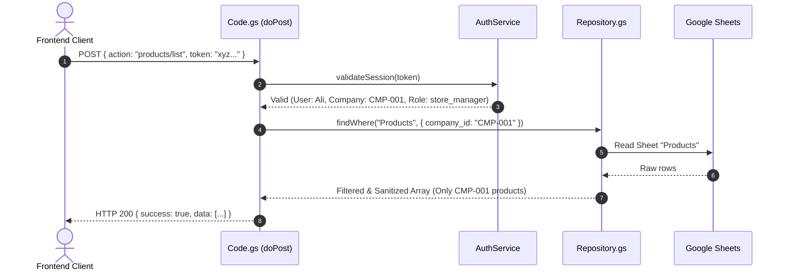

# StoreIQ — Multi-Company Store & Inventory Management SaaS

[](https://github.com/your-org/storeiq)
[](https://opensource.org/licenses/MIT)
[](https://reactjs.org/)
[](https://developers.google.com/apps-script)
[](https://www.google.com/sheets/about/)

---

## 📌 Project Overview

**StoreIQ** is a modern, lightweight, multi-tenant web application engineered for retail networks, warehouses, distributors, and multi-location businesses. It streamlines store management, real-time ledger-based stock operations, inter-store stock transfers, supplier management, role-based workforce administration, and multi-dimensional reporting.

Designed with a serverless, zero-infrastructure cost model for its MVP stage, StoreIQ leverages **React 18 + Tailwind CSS** on the frontend, **Google Apps Script (GAS)** as the API / compute layer, and **Google Sheets** as the relational database engine.

- **Product Name**: StoreIQ
- **Edition**: Multi-Company Store & Inventory Management SaaS
- **Version**: `1.0.0 MVP`
- **Architecture Style**: Serverless Jamstack + Micro-API Gateway + Sheet Relational Ledger

---

## 🏛 System Architecture

StoreIQ utilizes a decoupled, 4-tier layered architecture ensuring strict separation of concerns, multi-tenant partition isolation, and a seamless path to future database migration.

```
┌─────────────────────────────────────────────────────────────┐
│                 Client Layer (Browser / SPA)                │
│              React 18 + Vite + Tailwind CSS + Lucide        │
│          State: React Context | Routing: React Router v6    │
└──────────────────────────────┬──────────────────────────────┘
                               │  HTTPS POST (JSON Envelope)
                               ▼
┌─────────────────────────────────────────────────────────────┐
│               API Gateway Layer (doPost Router)             │
│        Google Apps Script Web App (Action Dispatcher)       │
│     - Session Authentication & RBAC Policy Middleware       │
│     - Concurrency Lock (LockService.getScriptLock)          │
│     - Payload Validation & Error Normalization              │
└──────────────────────────────┬──────────────────────────────┘
                               │
                               ▼
┌─────────────────────────────────────────────────────────────┐
│                   Business Logic Services                   │
│   AuthService  |  ProductService  |  StockService           │
│   TransferService | UserService   |  ReportService          │
│   SupplierService | SettingService|  AuditService           │
└──────────────────────────────┬──────────────────────────────┘
                               │
                               ▼
┌─────────────────────────────────────────────────────────────┐
│                  Repository Layer (DAL)                     │
│         Generic CRUD, Query Builders, Index Lookups         │
│     Company Isolation Enforcement (`company_id` filter)     │
└──────────────────────────────┬──────────────────────────────┘
                               │  SpreadsheetApp Batch API
                               ▼
┌─────────────────────────────────────────────────────────────┐
│                   Storage Engine (Database)                 │
│         Google Sheets Workbook (12 Relational Tables)       │
│    Companies, Users, Stores, Products, Transactions...      │
└─────────────────────────────────────────────────────────────┘
```

---

## 🛠 Tech Stack

| Layer / Domain | Technology / Library | Version | Purpose |
|----------------|----------------------|---------|---------|
| **Frontend Framework** | [React](https://react.dev/) | `^18.2.0` | Declarative component-based UI |
| **Build Tool & Bundler** | [Vite](https://vitejs.dev/) | `^5.0.0` | Ultra-fast HMR and optimized production build |
| **Styling & Design System** | [Tailwind CSS](https://tailwindcss.com/) | `^3.4.0` | Utility-first responsive styling and themes |
| **Routing** | [React Router DOM](https://reactrouter.com/) | `^6.21.0` | Client-side routing, protected route guards |
| **Iconography** | [Lucide React](https://lucide.dev/) | `^0.300.0` | Consistent, accessible SVG icon set |
| **Date & Time** | [date-fns](https://date-fns.org/) | `^3.0.0` | Immutable date parsing, arithmetic, and formatting |
| **Backend Runtime** | [Google Apps Script (V8)](https://developers.google.com/apps-script) | Modern JS | Serverless compute and API endpoints via `doPost` |
| **Database Engine** | [Google Sheets API](https://developers.google.com/sheets/api) | V4 via GAS | Multi-tab relational ledger database |
| **Concurrency Control** | Google Apps Script `LockService` | Native | Atomic locks preventing race conditions in stock updates |

---

## 📂 Project Structure

```
d:/Zakariya/zakarias-best/real-state/saas/
├── README.md                          # Main project guide & setup instructions
├── DATABASE.md                        # Complete 12-table relational schema & rules
├── API.md                             # Exhaustive endpoint specification & contracts
│
├── frontend/                          # Client Single-Page Application (SPA)
│   ├── index.html                     # HTML5 Entry point
│   ├── package.json                   # Node dependencies and scripts
│   ├── vite.config.js                 # Vite bundler configuration
│   ├── tailwind.config.js             # Tailwind CSS theme & plugin setup
│   ├── postcss.config.js              # PostCSS plugins
│   ├── public/                        # Static assets (favicons, logos)
│   │   └── favicon.ico
│   └── src/
│       ├── main.jsx                   # React root mount
│       ├── App.jsx                    # Root app component with providers & routing
│       ├── index.css                  # Global Tailwind imports & CSS variables
│       │
│       ├── api/                       # API integration & transport layer
│       │   ├── client.js              # Axios/Fetch wrapper with DEMO_MODE toggle
│       │   ├── endpoints.js           # API action constants mapping
│       │   └── mockData.js            # Offline mock dataset for instant preview
│       │
│       ├── config/                    # Application configuration
│       │   ├── constants.js           # API URLs, app meta, pagination limits
│       │   └── roles.js               # Role definitions, permission bitmasks
│       │
│       ├── context/                   # Global React context state providers
│       │   ├── AuthContext.jsx        # Auth state, login/logout, active user
│       │   ├── CompanyContext.jsx     # Active company & branch store switchers
│       │   └── NotificationContext.jsx# Toast notifications & alert banners
│       │
│       ├── hooks/                     # Custom reusable React hooks
│       │   ├── useAuth.js             # Quick access to AuthContext
│       │   ├── useStock.js            # Stock calculation & mutation hook
│       │   ├── useDebounce.js         # Search input debouncing
│       │   └── usePermission.js       # Dynamic RBAC permission check hook
│       │
│       ├── routes/                    # Route guarding and layout wrappers
│       │   ├── AppRoutes.jsx          # Route tree definitions
│       │   └── ProtectedRoute.jsx     # RBAC & authentication protection guard
│       │
│       ├── components/                # Reusable UI component library
│       │   ├── common/                # Primitives (Button, Modal, Input, Badge, Table)
│       │   │   ├── Button.jsx
│       │   │   ├── Modal.jsx
│       │   │   ├── Table.jsx
│       │   │   ├── Card.jsx
│       │   │   ├── Badge.jsx
│       │   │   ├── Input.jsx
│       │   │   └── Spinner.jsx
│       │   ├── layout/                # Shell (Sidebar, Header, Topbar, Footer)
│       │   │   ├── MainLayout.jsx
│       │   │   ├── Sidebar.jsx
│       │   │   ├── Header.jsx
│       │   │   └── StoreSelector.jsx
│       │   ├── dashboard/             # Metric cards, quick stats, chart widgets
│       │   ├── products/              # Product modals, barcode badges, filters
│       │   ├── stock/                 # Stock-in/Stock-out drawers, ledger views
│       │   ├── transfers/             # Transfer creation wizards, approval steps
│       │   ├── suppliers/             # Supplier cards and PO modals
│       │   ├── users/                 # User management drawers, role pickers
│       │   ├── reports/               # Data tables, CSV export buttons, filters
│       │   └── settings/              # Company profile forms, threshold inputs
│       │
│       ├── pages/                     # Routed view containers
│       │   ├── Login.jsx              # Sign-in portal with demo credentials
│       │   ├── Dashboard.jsx          # Operational metrics & activity feed
│       │   ├── Products.jsx           # Master catalog & category management
│       │   ├── Stock.jsx              # Stock In/Out operations & live ledger
│       │   ├── Transfers.jsx          # Inter-store stock transfer lifecycle
│       │   ├── Stores.jsx             # Store & warehouse directory
│       │   ├── Suppliers.jsx          # Supplier directory & purchase records
│       │   ├── Users.jsx              # Staff administration & role assignments
│       │   ├── Reports.jsx            # Inventory valuation & movement audits
│       │   ├── AuditLogs.jsx          # Immutable system activity trail
│       │   ├── Settings.jsx           # Company settings, alerts, preferences
│       │   └── NotFound.jsx           # 404 handler
│       │
│       └── utils/                     # Formatting & calculation utilities
│           ├── formatters.js          # Currency, date, barcode, and phone formatters
│           ├── validators.js          # Form validation routines
│           └── storage.js             # LocalStorage safe serialization helpers
│
└── gas/                               # Google Apps Script Backend (Serverless)
    ├── appsscript.json                # Project manifest & OAuth scopes
    ├── Code.gs                        # Entry point: doPost(e), doGet(e), Router
    ├── Config.gs                      # System constants, SPREADSHEET_ID, schema definitions
    ├── Database.gs                    # Database bootstrap, initializeDatabase(), table migrations
    ├── SeedData.gs                    # seedDemoData() with companies, users, products, stores
    ├── Repository.gs                  # Data Access Layer (DAL) for Google Sheets operations
    │
    ├── AuthService.gs                 # Auth token verification, password hashing, login/logout
    ├── ProductService.gs              # Product & Category business logic, SKU generation
    ├── CategoryService.gs             # Category CRUD & validation
    ├── StoreService.gs                # Store & warehouse branch logic
    ├── StockService.gs                # Stock In/Out transactions & ledger aggregation
    ├── TransferService.gs             # Transfer lifecycle (Create, Approve, Complete, Cancel)
    ├── UserService.gs                 # Staff user management & RBAC policy validation
    ├── SupplierService.gs             # Supplier & Purchase Order logic
    ├── ReportService.gs               # Aggregated valuation, stock alerts, activity feeds
    ├── SettingService.gs              # Company configuration & threshold updates
    └── AuditService.gs                # System-wide audit log recorder
```

---

## 🚀 Installation & Setup

### 1. Frontend Setup

Ensure you have [Node.js](https://nodejs.org/) (v18+ recommended) installed.

```bash
# Navigate to the frontend directory
cd d:/Zakariya/zakarias-best/real-state/saas/frontend

# Install dependencies
npm install

# Start the Vite local development server
npm run dev
```

The application will be accessible at `http://localhost:5173`.

### 2. Backend Setup (Google Apps Script)

Follow these steps to deploy the serverless Google Sheets backend:

1. **Create Google Spreadsheet & Script**:
   - Open [Google Sheets](https://sheets.new) and create a new blank spreadsheet. Name it `StoreIQ Database`.
   - Go to **Extensions > Apps Script** (or visit [script.google.com](https://script.google.com) and create a new project named `StoreIQ Backend`).

2. **Upload Script Files**:
   - In the Apps Script editor, create script files corresponding to the `.gs` files in the `gas/` directory (`Code.gs`, `Config.gs`, `Database.gs`, `Repository.gs`, `AuthService.gs`, `StockService.gs`, etc.).
   - Copy and paste the code from each local file into its matching Apps Script file.

3. **Initialize Database Schema**:
   - In the Apps Script toolbar, select the function `initializeDatabase` from the dropdown and click **Run**.
   - Review and grant the necessary Google account permissions when prompted.
   - Check the **Execution Log** (`Ctrl + Enter`). Note the Spreadsheet ID created or connected.

4. **Set Spreadsheet ID**:
   - Open `Config.gs` in the script editor.
   - Update `CONFIG.SPREADSHEET_ID` with your Spreadsheet ID:
     ```javascript
     const CONFIG = {
       SPREADSHEET_ID: "1AbCdEfGhIjKlMnOpQrStUvWxYz-1234567890",
       TOKEN_EXPIRY_HOURS: 24,
       MAX_PAGE_SIZE: 100,
       APP_NAME: "StoreIQ"
     };
     ```

5. **Seed Demo Data (Optional but Recommended)**:
   - Select the function `seedDemoData` from the function dropdown and click **Run**.
   - This populates all 12 tables with demo companies, users, warehouses, categories, products, stock entries, and transfers.

6. **Deploy as Web App**:
   - Click **Deploy > New deployment** in the top right.
   - Click the gear icon next to "Select type" and choose **Web app**.
   - Configure the deployment:
     - **Description**: `StoreIQ Production API v1`
     - **Execute as**: `Me (your_email@gmail.com)`
     - **Who has access**: `Anyone` *(Note: All requests are authenticated inside script logic using session tokens)*
   - Click **Deploy** and copy the **Web app URL** (e.g. `https://script.google.com/macros/s/AKfycbx.../exec`).

7. **Configure Frontend with API URL**:
   - Open `frontend/src/config/constants.js` and set `API_BASE_URL`:
     ```javascript
     export const API_BASE_URL = "https://script.google.com/macros/s/AKfycbx.../exec";
     ```

### 3. Demo Mode vs Live Mode

StoreIQ includes a full zero-dependency **Demo Mode** with mock data stored in memory/localStorage.

- **To run in Offline Demo Mode**:
  Open `frontend/src/api/client.js` and ensure:
  ```javascript
  export const DEMO_MODE = true;
  ```
  *(Default on fresh install — allows evaluating the entire UI and workflows without deploying Google Apps Script)*

- **To run in Live Backend Mode**:
  Set:
  ```javascript
  export const DEMO_MODE = false;
  ```
  The frontend will dispatch live HTTP POST requests to your deployed Google Apps Script URL.

---

## 👥 User Roles & Permissions Matrix

StoreIQ enforces strict Role-Based Access Control (RBAC) at both the UI layer (menu filtering, disabled buttons) and backend service layer.

| Role Key | Role Title | Scope | Description |
|---|---|---|---|
| `super_admin` | Super Administrator | Global (All Companies) | SaaS platform owner. Can create companies, manage tenants, and configure system-level settings. |
| `company_admin` | Company Administrator | Tenant (Single Company) | Business owner / Operations head. Full control over company stores, users, suppliers, products, settings, and reports. |
| `store_manager` | Store Manager | Store / Branch Level | Manages assigned store branches. Can initiate/approve stock transfers, adjust inventory, manage products, and view store reports. |
| `inventory_staff`| Inventory / Warehouse Staff | Store / Station Level | Operational clerk. Can perform Stock In, Stock Out, initiate transfer requests, and look up product catalogs. |
| `viewer` | Read-Only Auditor / Analyst | Store or Company | Stakeholder / Auditor. Can view dashboards, reports, and stock levels without write or mutation permissions. |

### Permissions Matrix

| Feature / Action | `super_admin` | `company_admin` | `store_manager` | `inventory_staff` | `viewer` |
|---|:---:|:---:|:---:|:---:|:---:|
| **Manage Companies (Tenants)** | ✅ | ❌ | ❌ | ❌ | ❌ |
| **Manage Company Settings** | ✅ | ✅ | ❌ | ❌ | ❌ |
| **Manage Stores & Branches** | ✅ | ✅ | 👁️ (Assigned) | 👁️ (Assigned) | 👁️ |
| **User Administration** | ✅ | ✅ | ❌ | ❌ | ❌ |
| **Manage Suppliers & POs** | ✅ | ✅ | 👁️ | ❌ | 👁️ |
| **Product & Category CRUD** | ✅ | ✅ | ✅ | 👁️ | 👁️ |
| **Perform Stock In / Out** | ✅ | ✅ | ✅ | ✅ | ❌ |
| **Initiate Stock Transfer** | ✅ | ✅ | ✅ | ✅ | ❌ |
| **Approve / Complete Transfer** | ✅ | ✅ | ✅ | ❌ | ❌ |
| **View Audit Trail Logs** | ✅ | ✅ | ❌ | ❌ | ❌ |
| **View Financial & Valuation Reports** | ✅ | ✅ | ✅ (Store only) | ❌ | 👁️ (Read only) |

---

## 🗄 Database Structure Overview

StoreIQ uses a normalized relational model organized across **12 Google Sheets tabs**. Full schemas, data types, constraints, and formulas are detailed in [DATABASE.md](./DATABASE.md).

```
1.  Companies           ─ Tenant profile, currency, plan, status
2.  Users               ─ Multi-tenant staff accounts with salted password hashes
3.  Stores              ─ Store branches, warehouses, physical locations
4.  Categories          ─ Product categorization hierarchy
5.  Products            ─ Master catalog with SKUs, barcodes, unit prices, reorder levels
6.  Stock_Transactions  ─ Immutable double-entry inventory ledger (IN / OUT / ADJ)
7.  Stock_Transfers     ─ Multi-step transfer workflow (Requested -> Approved -> Completed)
8.  Suppliers           ─ Vendor directory, contact info, payment terms
9.  Purchases           ─ Procurement orders, receiving records, invoice references
10. Audit_Logs          ─ Immutable chronological trail of user actions & mutations
11. Settings            ─ Company-specific configurations, low-stock thresholds
12. Sessions            ─ Active authentication tokens, client IP/agent, expiry
```

👉 **See [DATABASE.md](./DATABASE.md) for complete column-by-column definitions, constraints, and mermaid ER diagrams.**

---

## 🔌 API Documentation Overview

The backend exposes a single unified HTTP POST API gateway via Google Apps Script's `doPost(e)` function, dispatching actions to specialized domain services.

```
POST https://script.google.com/macros/s/{DEPLOYMENT_ID}/exec
Content-Type: text/plain;charset=utf-8

{
  "action": "stock/in",
  "token": "sess_89f1a7b8e...",
  "payload": {
    "store_id": "STR-001",
    "product_id": "PRD-1002",
    "quantity": 50,
    "unit_cost": 12.50,
    "notes": "PO-9844 Delivery"
  }
}
```

👉 **See [API.md](./API.md) for the complete list of 41 API endpoints, request schemas, success responses, and error codes.**

---

## 🏢 Multi-Tenant Architecture & Data Isolation

StoreIQ achieves logical multi-tenancy inside a shared relational schema through mandatory **`company_id` partition binding**:

1. **Authentication Context**: Upon login, the user's `company_id` and assigned `role` are embedded in the active session stored in the `Sessions` sheet.
2. **Session Interceptor**: On every incoming API request, `AuthService.validateToken(token)` extracts the authenticated user record.
3. **Repository Partitioning**: The data access layer (`Repository.gs`) automatically injects `company_id == user.company_id` into every row query, update, and insert.
4. **Zero Cross-Tenant Leakage**: Even if a malicious user crafts an ID belonging to another company (e.g. `PRD-COMPANY-B-001`), the query returns `404 NOT_FOUND` because the repository filters on `company_id`.



---

## 📦 Ledger-Based Inventory Logic

Unlike naive inventory systems that overwrite a mutable `quantity` integer column in a products table, StoreIQ uses an **immutable ledger-based transaction engine** (similar to double-entry accounting).

### Why Ledger-Based?
- **Auditability**: Every stock change records who, when, why, and which store was affected.
- **Race Condition Prevention**: Concurrent updates cannot overwrite each other's balances.
- **Historical Reconstruction**: Stock on any given past date can be determined with 100% precision by summing transactions up to that timestamp.

### Formula for Current Stock:
$$\text{Current Stock}_{(p, s)} = \sum \text{IN}_{(p, s)} - \sum \text{OUT}_{(p, s)} + \sum \text{XFER\_IN}_{(p, s)} - \sum \text{XFER\_OUT}_{(p, s)} \pm \sum \text{ADJUSTMENT}_{(p, s)}$$

Where:
- $p$ = Product ID
- $s$ = Store ID
- $\text{IN}$ = Purchases, supplier deliveries, initial inventory
- $\text{OUT}$ = Sales, customer dispatch, damages, expired write-offs
- $\text{XFER\_IN}$ = Completed transfers received at store $s$
- $\text{XFER\_OUT}$ = Completed transfers dispatched from store $s$
- $\text{ADJUSTMENT}$ = Physical count reconciliation adjustments

---

## 🔒 Security & Data Protection

StoreIQ is built following defense-in-depth principles:

1. **Session Tokens**: Cryptographically secure alphanumeric tokens stored in `Sessions` with TTL expiration (default: 24 hours).
2. **Password Security**: Passwords are never stored in plaintext. Hashed using SHA-256 with tenant-specific salt values.
3. **RBAC Guarding**: Every service function checks `AuthService.hasPermission(user, requiredRole)` prior to executing business logic.
4. **Atomic Concurrency Locks**: Uses Apps Script's `LockService.getScriptLock()` with a 10-second timeout on stock mutations and transfers, preventing double-spending of inventory.
5. **Comprehensive Audit Trails**: All mutating actions automatically log an entry into the `Audit_Logs` sheet with user ID, IP/User-Agent, action name, and JSON state diffs.
6. **Server-Side Input Sanitization**: Strict type checking and validation prevent injection and corrupted cell data.

---

## 🌐 Deployment Guide

StoreIQ can be hosted for **$0/month** on industry-standard serverless and static web hosting platforms.

### Frontend Deployment Options

#### Option A: Vercel (Recommended)
1. Push your code to GitHub.
2. Log in to [Vercel](https://vercel.com) and import the repository.
3. Set **Root Directory** to `frontend`.
4. Build settings will auto-detect Vite:
   - **Build Command**: `npm run build`
   - **Output Directory**: `dist`
5. Click **Deploy**.

#### Option B: Netlify
1. Log in to [Netlify](https://www.netlify.com/) and choose "Import from Git".
2. Set **Base directory**: `frontend`, **Build command**: `npm run build`, **Publish directory**: `frontend/dist`.
3. Add a `_redirects` file in `frontend/public/` containing `/* /index.html 200` to support React Router HTML5 pushState.

#### Option C: GitHub Pages
1. In `frontend/vite.config.js`, set `base: '/your-repo-name/'`.
2. Run `npm run build` and deploy the `dist/` directory via `gh-pages` branch or GitHub Actions.

### Backend & Database Deployment
- The backend is hosted permanently and free on Google's global Apps Script infrastructure.
- Database is stored in Google Drive inside your Google Sheet.

---

## 📊 Google Sheets Limits & Operational Thresholds

When using Google Sheets as a database, be aware of standard Google Workspace quotas:

| Metric | Google Workspace Limit | StoreIQ Optimization / Solution |
|---|---|---|
| **Max Cells per Spreadsheet** | 10 Million cells | 12 tables with ~15 columns can easily store **> 500,000 transaction records**. |
| **API Request Rate** | 300 requests / minute | Frontend caches product and category catalogs; uses batch reads. |
| **Script Execution Timeout** | 6 minutes / execution | Individual API requests execute in 150ms–600ms. |
| **Concurrent Read/Writes** | Handled via LockService | Managed via `LockService.getScriptLock()` queue. |
| **Query Performance** | Fast (<50K rows) | When transaction volume approaches 50K rows, run the provided archival script or migrate to PostgreSQL. |

---

## 🔄 Future Migration Path (To PostgreSQL / Supabase)

StoreIQ was intentionally built using the **Repository Pattern** (`Repository.gs` in GAS, client layer in React).

```
┌─────────────────────────────────────────────────────────────┐
│                 React Frontend (Unchanged)                  │
└──────────────────────────────┬──────────────────────────────┘
                               │
                               ▼
┌─────────────────────────────────────────────────────────────┐
│                   Domain Services Layer                     │
└──────────────────────────────┬──────────────────────────────┘
                               │
            ┌──────────────────┴──────────────────┐
            ▼                                     ▼
┌───────────────────────┐             ┌───────────────────────┐
│ Google Sheet Repo     │   ──────>   │ PostgreSQL / Supabase │
│ (Current MVP Layer)   │  Migration  │ Prisma / Drizzle ORM  │
└───────────────────────┘             └───────────────────────┘
```

To migrate to a dedicated SQL backend:
1. Replace `Repository.gs` / GAS endpoints with a Node.js / Express or Next.js / Supabase backend.
2. The frontend API client and action contracts (`API.md`) remain **100% identical**.
3. All table schemas in `DATABASE.md` map 1:1 to standard SQL `CREATE TABLE` DDL statements.

---

## 🧪 Testing & Verification Scenarios

The MVP specification includes 7 core end-to-end verification test cases:

```
[TEST-01] Multi-Tenant Isolation Test
  ├── Log in as Admin of Company A (CMP-001)
  ├── Attempt to fetch product or store from Company B (CMP-002)
  └── PASS: System returns 404 NOT_FOUND / Empty list. Zero cross-tenant data leaks.

[TEST-02] Authentication & Session Lifecycle
  ├── Test valid login -> token returned -> user profile loaded
  ├── Test invalid password -> 401 INVALID_CREDENTIALS
  ├── Test expired token -> 401 TOKEN_EXPIRED
  └── Test logout -> token invalidated in Sessions sheet.

[TEST-03] Stock Ledger & Consistency Test
  ├── Perform Stock In of 100 units to Store STR-001
  ├── Perform Stock Out of 30 units from Store STR-001
  ├── Verify computed stock equals exactly 70 units
  └── Attempt Stock Out of 80 units -> PASS: Error INSUFFICIENT_STOCK.

[TEST-04] Inter-Store Stock Transfer Workflow
  ├── Store A initiates transfer of 20 units to Store B (Status: PENDING)
  ├── Store A inventory reflects 20 units in transit
  ├── Store B Manager approves & completes transfer (Status: COMPLETED)
  └── Store A stock decreases by 20; Store B stock increases by 20.

[TEST-05] Role-Based Access Control (RBAC) Enforcement
  ├── Log in as 'viewer' -> Attempt to execute `stock/in` -> PASS: 403 FORBIDDEN
  ├── Log in as 'inventory_staff' -> Attempt to execute `users/create` -> PASS: 403 FORBIDDEN
  └── Log in as 'company_admin' -> Full access granted.

[TEST-06] Low Stock Alert & Reporting Accuracy
  ├── Set Product Reorder Level to 25 units
  ├── Reduce stock to 15 units via `stock/out`
  └── PASS: Product instantly appears in dashboard Low Stock alerts & reports.

[TEST-07] Immutable Audit Logging Trail
  ├── Perform user update, product edit, and stock adjustment
  └── PASS: Query `audit/list` and verify 3 exact log records with user_id, action, timestamp, and diff payload.
```

---

## 📄 License

This project is licensed under the **MIT License** — see the [LICENSE](LICENSE) file for details.

```
Copyright (c) 2026 StoreIQ SaaS

Permission is hereby granted, free of charge, to any person obtaining a copy
of this software and associated documentation files (the "Software"), to deal
in the Software without restriction, including without limitation the rights
to use, copy, modify, merge, publish, distribute, sublicense, and/or sell
copies of the Software, and to permit persons to whom the Software is
furnished to do so, subject to the following conditions:

The above copyright notice and this permission notice shall be included in all
copies or substantial portions of the Software.
```
